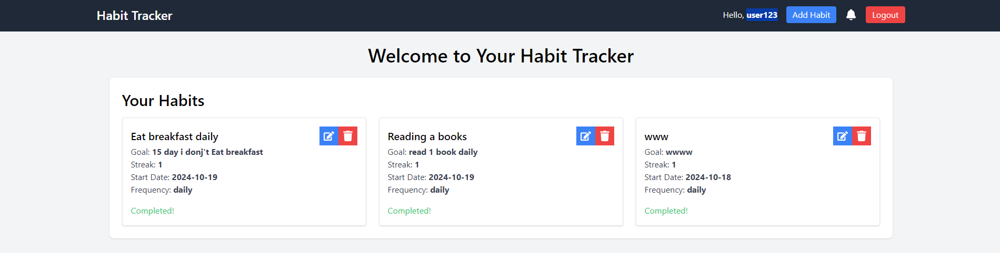
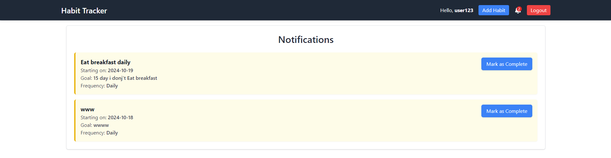

# Habit Tracker - (Create React App)

## Overview

The Habit Tracker Application is a responsive, user-friendly platform designed to help users build and maintain healthy habits by tracking their progress over time. The application allows users to set daily, weekly, or monthly habits, view motivational messages, and track their performance. Additionally, admin users can manage habit templates, view analytics, and oversee user data.

The project is built using React for the frontend, Tailwind CSS for styling, Context API for state management, and localStorage for persistent data storage. It features a clean, mobile-first design, making it easily accessible across all devices. this website is available on :https://habit-tracker-sigma-silk.vercel.app/




## Features

### User Features:

- Dashboard: Displays a list of daily habits, tracking progress, streak count, and providing motivational messages to encourage users.
- Habit Management: Users can add new habits with details like habit name, goal, start date, and frequency (daily, weekly, or monthly).
- Habit Tracking: Users can mark habits as complete, view their current streak, and track weekly or monthly progress.
- Profile Management: Users can edit their profile details, including setting personal goals or motivational messages.
- Habit Notifications: Users receive notifications for upcoming or incomplete habits, helping them stay consistent.

### Admin Features:

- Admin Dashboard: Admins have access to an overview of all users' habits, with analytics and tracking information.
- Habit Template Management: Admins can create and manage habit templates, making it easier for users to select from predefined habits.
- User Management: Admins can view and manage users' data, providing insights into user engagement and progress.

## Installation

- Clone the repository:

```
git clone https://github.com/desai-pratik/habit-tracker.git
```

- Navigate to the project directory:

```
cd habit-tracker
```

- Install dependencies:

```
npm install
```

- Start the development server:

```
npm start
```

- This will open the app in your browser at http://localhost:3000.
